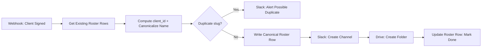

# Client Onboarding Automation (n8n)

A working automation that fixes a common ops failure mode: three teams (finance, account management, people ops) manually onboarding a new client in an unordered, untracked way — leading to silently mismatched names between systems (`"Acme Co"` vs `"Acme Corp"`) that break downstream exact-match lookups weeks later.

This connects two of the three onboarding steps end-to-end — **Slack channel + Drive folder + roster entry** — triggered by a single webhook standing in for "client signs." The third step (billing) is deliberately *not* wired into this graph; see [Design Decisions](#design-decisions) for why.

## What it does



1. A webhook fires (in production: a CRM "Closed Won" event) carrying the client's legal name, contact email, and account owner.
2. The existing roster is read, purely to compute the next `client_id` and check for a near-duplicate `slug`.
3. **One Code node** derives a canonical `client_id` and canonical name **once** — this is the entire fix for the naming-mismatch problem (see below).
4. If the slug already exists, it stops and posts a Slack alert instead of creating duplicate resources.
5. Otherwise: writes the roster row, creates the Slack channel, creates the Drive folder — both named from the *same* stored canonical value — then marks the row done with the real channel ID and folder URL.

## Design decisions

**The naming-mismatch fix is structural, not cosmetic.** The root problem was never "people type carelessly" — it's that the same client name gets manually typed by three different people with no shared source, so divergence is the *expected* output of that process, not an edge case. The fix: canonicalize the name **once**, at intake, before anything downstream exists. A single Code node strips corporate suffixes (`Inc`, `Corp`, `LLC`, `Co`, `Ltd`), derives a `slug` and `display_name`, and writes that to the roster row *before* the Slack channel or Drive folder are created. Neither of those is ever named by a human — they're named programmatically from the one value the Code node already committed. There is structurally only one place the name is ever authored.

**Billing was deliberately not built here.** The naming-collision bug lives entirely between the Slack/Drive/roster trio — nothing in the original problem statement said billing's stored name is ever referenced by exact-match anywhere else. Billing legitimately needs a different string than the trade name anyway (a full legal entity name for the paper trail, vs. a short canonical name for a Slack channel). In a real build, billing would fire off the *same* webhook trigger, in parallel, writing `{client_id, legal_name, billing_status}` into its own record — not chained after Slack/Drive, since it doesn't depend on the canonical trade name at all.

**"Done" is defined narrowly, on purpose.** Three teams want three different signals: the account team wants immediate visibility, finance wants a paper trail, people ops wants the roster correct. This build treats the roster row's existence (with a locked canonical name) as the only thing that gates "done," because it's the only piece other systems structurally depend on via exact-match lookup. Slack/Drive completion and billing status are tracked as independent fields on the same record, but neither blocks the done-flag. **This disadvantages the account team** — they may finish their part (channel + folder exist) before the roster write lands, and the system won't call onboarding "done" yet from their point of view. That's an accepted tradeoff, not an oversight.

## Stack

- **n8n** (self-hosted) for orchestration
- **Google Sheets** as the mock roster / system of record
- **Slack API** (real) for channel creation
- **Google Drive API** (real) for folder creation
- A **Webhook** node standing in for a CRM "deal closed" event

## Running it yourself

1. Import [`workflow.json`](./workflow.json) into your own n8n instance.
2. Create a Google Sheet with a `Roster` tab, header row: `client_id, legal_name, display_name, slug, slack_channel_id, drive_folder_url, slack_drive_status, billing_status, created_at`.
3. Reconnect the Google Sheets, Slack, and Google Drive credentials (stripped from this export — see [Security notes](#security-notes)).
4. Re-point the `documentId` fields at your own spreadsheet ID.
5. Publish the workflow and POST to the webhook:

```bash
curl -X POST http://localhost:5678/webhook/new-client-signed \
  -H "Content-Type: application/json" \
  -d '{"legal_name":"Acme Corp","primary_contact_email":"jane@acme.com","account_owner":"Jane Doe"}'
```

## Security notes

This export has been sanitized before publishing:
- No credentials, tokens, or OAuth secrets are included — n8n never exports those, only credential *names*.
- The real Google Sheet ID and Slack channel ID used during development have been replaced with placeholders (`YOUR_GOOGLE_SHEET_ID`, `YOUR_SLACK_ALERT_CHANNEL_ID`).
- Internal credential reference IDs have been redacted (they're meaningless outside the original n8n instance, but stripped anyway as good practice).


